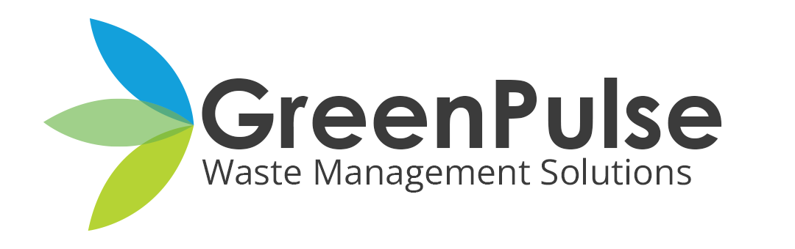

#   
# **GreenPulse – Smart Waste Management System**  
**Revolutionizing waste collection with IoT and AI-driven route optimization**

## Table of Contents
- [About the Project](#about-the-project)
- [Features](#features)
- [Solution Architecture](#solution-architecture)
- [Tech Stack](#tech-stack)

---

## About the Project  
GreenPulse is a smart waste management system designed to optimize garbage collection using IoT sensors, real-time monitoring, and route optimization. The system includes a **mobile app for bin users**, a **web dashboard for garbage collectors**, and a **mobile app for collection truck drivers** to streamline operations.

---

## **Features**  

### **Bin Status & Maintenance Monitoring**  
- Bin owners can monitor fill levels and maintenance needs.  
- Garbage collectors get alerts for bin maintenance.  
- AI-based garbage segregation using image processing.  

### **Garbage Collection Route Optimization**  
- AI-driven route optimization for collection trucks.  
- Web dashboard for route monitoring.  
- IoT sensors send bin status updates in real-time.  

### **Collection Truck App**  
- Truck drivers receive optimized collection routes.  
- Real-time route updates via mobile app.   

### **Admin Dashboard for Bin Sellers & Management**  
- Bin sellers (garbage collectors) can monitor bin inventory.  
- Manage and track garbage collection process.

---

## **Solution Architecture**
# 

**IoT Devices** (Smart Bins)  
   - Sensors detect bin fill levels & blockages.  
   - Sends data to AWS IoT Core via MQTT.  

**Backend** (Spring Boot)  
   - Processes IoT data & manages user roles.  
   - AI-based route optimization algorithm.  

**Web & Mobile Apps**  
   - Web app for garbage collectors (React).  
   - Mobile app for bin users & truck drivers (Flutter).  

**Cloud & DevOps**  
   - **AWS IoT Core** for MQTT messaging.  
   - **AWS EC2 & S3** for hosting.  
   - **GitHub Actions** for CI/CD automation.  

---

## **Tech Stack**  

| Component       | Technology |
|----------------|------------|
| **Frontend**   | React (Web), Flutter (Mobile) |
| **Backend**    | Spring Boot, JWT Authentication |
| **IoT**        | Raspberry 3B+, AWS IoT Core (MQTT) |
| **AI/ML**      | Image Processing (Garbage Sorting) |
| **Cloud**      | AWS EC2, AWS S3, Amazon RDS |
| **DevOps**     | Docker, GitHub Actions (CI/CD) |
